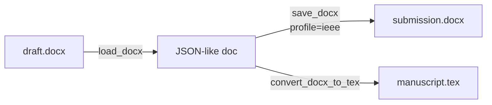
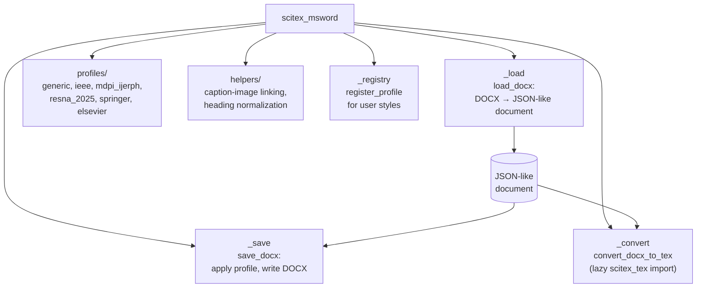

# scitex-msword

<p align="center">
  <a href="https://scitex.ai">
    
  </a>
</p>

<p align="center"><b>MS Word (.docx) reader/writer with journal-style profiles.</b></p>

<p align="center">
  <a href="https://scitex-msword.readthedocs.io/">Full Documentation</a> · <code>uv pip install scitex-msword[all]</code>
</p>

<!-- scitex-badges:start -->
<p align="center">
  <a href="https://pypi.org/project/scitex-msword/"></a>
  <a href="https://pypi.org/project/scitex-msword/"></a>
  <a href="https://scitex-msword.readthedocs.io/en/latest/"></a>
</p>
<p align="center">
  <a href="https://github.com/ywatanabe1989/scitex-msword/actions/workflows/ci.yml"></a>
  <a href="https://codecov.io/gh/ywatanabe1989/scitex-msword"></a>
</p>
<!-- scitex-badges:end -->

---

## Quick Start

```python
import scitex_msword as sxm

# Word -> intermediate JSON-like document
doc = sxm.load_docx("input.docx", profile="generic")

# JSON-like document -> Word (apply a journal style)
sxm.save_docx(doc, "output.docx", profile="mdpi-ijerph")

# DOCX -> LaTeX (needs the [tex] extra for the .tex export step)
sxm.convert_docx_to_tex(
    "manuscript.docx", "manuscript.tex",
    profile="resna-2025", image_dir="figures",
)
```

## Demo



<p align="center"><sub><b>Figure 1.</b> Round-trip: DOCX through a JSON-like intermediate, re-rendered with IEEE column widths, fonts, and heading numbering.</sub></p>

```python
import scitex_msword as sxm

doc = sxm.load_docx("draft.docx", profile="generic")
sxm.save_docx(doc, "submission.docx", profile="ieee")
```

Round-trips DOCX through a JSON-like intermediate, then re-renders with IEEE
column widths, fonts, and heading numbering applied automatically.

## Installation

```bash
uv pip install "scitex-msword[all]"
```

Requires Python >= 3.9.

<details>
<summary><b>Per-module extras</b></summary>

<br>

| Extra | Pulls in |
|---|---|
| `all` | `tex` + `mcp` (recommended) |
| `tex` | scitex-tex (DOCX → LaTeX export) |
| `mcp` | mcp SDK (MCP server) |
| `dev` | pytest, pytest-cov, ruff + scitex-dev (contributors) |
| `docs` | Sphinx + RTD theme + myst-parser (docs build only) |

```bash
uv pip install -e ".[dev]"   # editable install for contributors
```

</details>

## Architecture



<p align="center"><sub><b>Figure 2.</b> Document flow in scitex-msword: load once into a JSON-like intermediate, then render to styled DOCX or LaTeX.</sub></p>

## 1 Interfaces

<details open>
<summary><strong>Python API</strong></summary>

<br>

```python
import scitex_msword as sxm

# Round-trip
doc = sxm.load_docx("paper.docx", profile="generic")
sxm.save_docx(doc, "paper-styled.docx", profile="ieee")

# Helpers
sxm.link_captions_to_images(doc)
sxm.link_captions_to_images_by_proximity(doc)
sxm.normalize_section_headings(doc)
sxm.validate_document(doc)
sxm.create_post_import_hook(doc)

# Register custom profile
sxm.register_profile("my-style", {...})
```

### Review / dogfooding helpers (unreleased)

```python
import docx
import scitex_msword as sxm

# 1. Diff two .docx versions by paragraph (paragraphs in/out + run-level
#    bold / italic / font / highlight deltas).
ops = sxm.diff_docx("v15.docx", "v16.docx")
sxm.summarize_diff(ops)            # {'equal': 38, 'insert': 4, 'delete': 1, 'modify': 3}

# 2. Visualize edits with highlights (BOOST review convention).
doc = docx.Document("v16.docx")
sxm.mark_additions(doc, runs=[(3, 0), (5, 2)])     # default turquoise
sxm.mark_modifications(doc, runs=[(7, 1)])         # default magenta -> Word PINK

# 3. Read highlights back, bucketed by color name.
sxm.extract_highlights(doc)        # {'turquoise': [...], 'pink': [...]}

# 4. Bold-preserve keyword tokens (Japanese tokens get MS Gothic).
sxm.preserve_bold_tokens(doc, tokens=["JST", "BOOST", "Sovereign Tech"])

# 5. Pull Word comments + their anchor ranges.
comments = sxm.extract_comments("v16.docx")
# Optionally apply REPLACE:-grammar comments as edits.
summary = sxm.apply_comments_as_edits(doc)         # {'applied': 2, 'skipped': 4, ...}
```

### Track Changes (revision) helpers

```python
import docx
import scitex_msword as sxm

# 1. Turn Word's "Track Changes" switch on, so subsequent operator edits
#    are recorded as revisions (writes <w:trackChanges/> to settings.xml).
doc = docx.Document("draft.docx")
sxm.enable_track_changes(doc, enabled=True)
sxm.is_track_changes_enabled(doc)        # True

# 2. Wrap agent edits as <w:ins> / <w:del> so Word renders them as
#    accept/reject-able revisions.
p = doc.paragraphs[10]
sxm.wrap_as_tracked_insertion(p, runs=[2, 3], author="agent")
sxm.wrap_as_tracked_deletion(p, runs=[5],    author="agent")

# 3. Inspect all tracked changes (structured).
for c in sxm.extract_tracked_changes(doc):
    print(c["type"], c["author"], c["text"])

# 4. Bulk accept / reject (Word's "Accept All" / "Reject All").
sxm.accept_all_tracked_changes(doc)        # or reject_all_tracked_changes
doc.save("draft_v27.docx")
```

### MCP server (optional)

```bash
uv pip install "scitex-msword[mcp]"
python -m scitex_msword.mcp_server          # stdio transport
```

Tools exposed: `diff_docx_tool`, `mark_additions_tool`,
`mark_modifications_tool`, `preserve_bold_tokens_tool`,
`extract_highlights_tool`, `extract_comments_tool`, `list_profiles_tool`.

### Built-in profiles

`generic`, `mdpi-ijerph`, `resna-2025`, `iop-double-anonymous`, `ieee`,
`springer`, `elsevier`, `boost-2026`.

</details>

## Status

Standalone fork of `scitex.msword`. Runtime deps: `python-docx`, `click`,
`scitex-logging` (`scitex-tex` additionally for `convert_docx_to_tex` via
the `[tex]` extra). The umbrella `scitex.msword` import path is preserved
via a `sys.modules`-alias bridge.

## Part of SciTeX

`scitex-msword` is part of [**SciTeX**](https://scitex.ai). Install via
the umbrella with `pip install scitex[msword]` to use as
`scitex.msword` (Python) or `scitex msword ...` (CLI).

>Four Freedoms for Research
>
>0. The freedom to **run** your research anywhere — your machine, your terms.
>1. The freedom to **study** how every step works — from raw data to final manuscript.
>2. The freedom to **redistribute** your workflows, not just your papers.
>3. The freedom to **modify** any module and share improvements with the community.
>
>AGPL-3.0 — because we believe research infrastructure deserves the same freedoms as the software it runs on.

## License

AGPL-3.0-only (see [LICENSE](./LICENSE)).

---

<p align="center">
  <a href="https://scitex.ai" target="_blank"></a>
</p>
